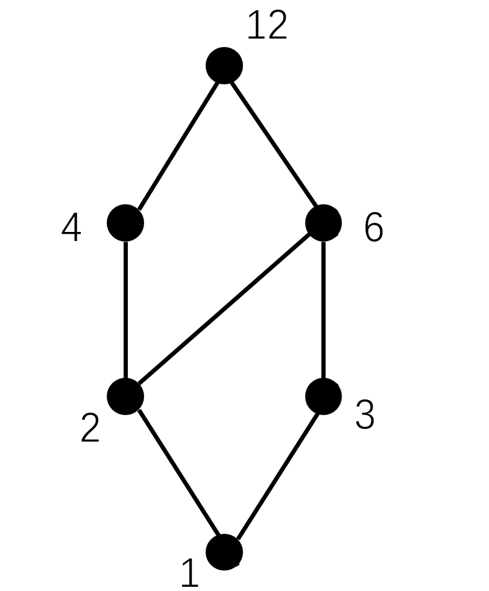

---
tags:
  - 数学
  - 离散数学
excerpt: 这段文字和上面文字间又有什么关系呢
---
# 关系

**关系（relation）** 与生活中的关系别无二致，就是一个东西和另一个东西的关系（废话

但是为了表示这种东西，数学家又要用某些符号系统来表示
## 序偶（有序对）

**序偶（ordered couple）** 啊就是两个有序排列的东西，比如$x$和$y$的排列方式就有$<x,y>$和$<y,x>$两种

像坐标就是一个序偶

那如果我们要表示很多可能相近的关系又该怎么办呢，总不能写一大堆吧

如果有两个集合 $A$ 和 $B$ ，我想要一大堆（全部）从$A$中元素到$B$中元素的关系要怎么样呢

 $A \times B$ 表示 $A$ 和 $B$ 的**笛卡尔积**，就是一个包含了很多 $<x,y>$ 的集合， $x$ 属于 $A$ 而 $y$ 属于 $B$ 

## 那什么是关系呢

如果一个集合里面全都是序偶，那这个**集合**就是一个**二元关系**，被记作$R$

如果呢 $<x,y> \in R$ ，那 $x$ 和 $y$ 以 $R$ 相关，写作 $xRy$ 

如果 $R \subseteq A \times B$ ，那 $R$ **就是** $A$ **到** $B$ **的一个关系**，如果 $A$ 就是 $B$ ， $B$ 就是 $A$ ，那 $R$ 就是 $A$ 上的关系

 $\varnothing$ 是任意集合上的**空关系**， $E_A=A \times A$ 是 $A$ 上的**全域关系**，$I_A=\{ <x,x> | x \in A \}$叫$A$上的恒等关系

如果说有个关系$R$，那它的所有序偶的**第一个元素**的集合叫它的**定义域**或者**前域**，和初中学的是一个东西，记作$dom~R$，当然也有**值域**或者**后域**，记作$ran~R$，还有个$fld~R = dom~ ~R \cup ran~ ~R$叫做$R$的**域（field）** 

### 我们的关系又该如何表示？

最最数学的方法就是用**集合**来表示啦，也就是在某个集合里面塞上一堆序偶

或者也可以用**图**，更准确地说是**有向图**来表示，对一个$<x,y>$，只需要画一条从$x$到$y$的有向线段就好啦

亦可以用**关系矩阵**，和那个表示图的[邻接矩阵](https://oi-wiki.org/graph/save/#%E9%82%BB%E6%8E%A5%E7%9F%A9%E9%98%B5)是一样的，非常简单

## 关系有什么性质呢

有的关系有特殊的性质，这些性质很多时候是比较好使的

某个关系有**自反性**指这个集合上的**所有元素**都和自己有这个关系，比如说在$\{1,2,3\}$上的关系$R_1 = \{ <1,1>,<2,2>,<3,3> \}$就是有自反性的，而$R_2 = \{ <1,1>,<2,2> \}$就不是；相反，如果**每个元素**都和自己**没**这个关系，那这个关系就有**反自反性**

而**对称性**是指一个关系里面每个$<x,y>$都有对应的$<y,x>$；**反对称性**则是指关系里除了$<x,x>$这种自己对自己的序偶之外都不对称

**传递性**是说一个关系里如果有$<x,y>,<y,z>$，那也一定有$<x,z>$，传递性好像反不了（

很容易发现 $=$ 是满足上面三个关系的哎

## 关系当然是可以运算的

作为一种**集合**，**关系**当然可以进行[集合](2025-03-01-集中在一起就是集合.md)的所有运算，除此之外当然还有些别的

### 复合运算（就像复合函数一样）

就像$f \circ g=g(f(x))$一样，$R \circ S$表示类似的概念，具体懒得写出来了，反正是一样的（

### 逆运算

顾名思义，**逆运算**就是把原本关系的所有序偶给反向，比如有个关系$R=\{ <1,2>,<3,4> \}$那它的逆就是$R^{-1}=\{<2,1>,<4,3>\}$，非常的简单

显然有$(R \circ S)^{-1} = S^{-1}\circ R^{-1}$

### 幂运算

专家定义在$A$上的关系$R$有$R^0=\{<x,x>|x \in A\}$，对任何$n\geq 1$有$R^n = R^{n-1} \circ R$

对于有限集$A$上面的关系$R$，存在自然数 $t,s$ 使 $R^t=R^s$

这是因为无论幂运算几次，其中的元素都是在$A\times A$里面的，而$A\times A$的子集是有限的，于是在不限制$n$的情况下必然会有$R^t=R^s$撞车

### 闭包运算

啥是闭包运算呢~~说实话都不知道为啥要叫闭包~~，就是说在某个集合$A$上的某个关系$R$没有某个关系应该有的性质，然后又能找到一个**最小**的有这个性质的$R'$符合$R\subseteq R'$，那这个$R'$就叫做$R$的某某闭包

$R$的**自反闭包**记作$r(R)$，**对称闭包**记作$s(R)$，**传递闭包**记作$t(R)$

显然 $\displaystyle r(R)=R \cup I_A,~s(R)=R\cap R^{-1},~t(R)=\bigcup^{\infty}_{i=1}R^i,~若|A|=n,~t(R)=\bigcup^{n}_{i=1}R^i$ 

还有一些乱七八糟的性质

$$
\begin{aligned} 
rs(R)=sr(R) \\
rt(R)=tr(R) \\ 
st(R)\subseteq ts(R)
\end{aligned} 
$$

$$
\begin{aligned} 
r(R_1)\cup r(R_2) = r(R_1\cup R_2) \\
s(R_1)\cup s(R_2) = s(R_1\cup R_2) \\ 
t(R_1)\cup t(R_2) \subseteq t(R_1\cup R_2)
\end{aligned} 
$$

## 有什么关系是特殊的呢

当然是有的，像是**等价关系**、**相容关系**和**偏序关系**是三类有特殊性质的关系，且等价关系$\subseteq$相容关系

### 等价关系

**等价关系**可以用来表示等价~~（废话）~~，只需要一个关系具有**自反性**、**对称性**和**传递性**就行

模 $n$ 同余关系就是一种等价关系，记作$x\equiv y \pmod n$也就是

```python
x % n == y % n # 显然 x 和 y 和 n 必须是自然数
```

如果一个集合 $A$ 有个等价关系 $R$ ，又有个 $x$ 在这个 $R$ 关系里面，那 $A$ 里所有和 $x$ 等价的元素可以组成一个集合 $[x]_R$ ，这个集合叫做 $x$ 关于 $R$ 的**等价类**， $x$ 叫做这个等价类的**生成元**或者**代表元**

如果把由 $R$ 所决定的**所有**等价类又都放到一个集合里面，那这个新的集合叫做 $A$ 关于 $R$ 的**商集**，记作 $A/R$

举个栗子： $A=\{ 1,2,3,4,5,6,7,8 \}$， $R$ 是 $x\equiv y \pmod 3$ ，那么

$$
A/R=\{ \{ 1,4,7 \},\{2,5,8\},\{3,6\} \}
$$

非常的简单

对于某个集合 $A$，如果把它拆成一些元素**不遗漏不重复**的**非空子集**，那这些集合组成的**集合**叫做 $A$ 的一个**划分**，里面的那些子集叫做划分的**块**或**类**，显然上面的 $A/R$ 就是一个划分，这些称为商集的划分又叫 $R$ 导出的**等价划分**

通过某个划分， 可以通过下面这样导出它对应的等价关系

$$
R=(S_1\times S_1) \cup (S_2 \times S_2)\cup \cdots \cup (S_m \times S_m)
$$

只要一个关系具有**自反性**和**对称性**，那这个关系就是**相容关系**，但是这玩意确实没啥可以讲的，基本都和等价关系差不多

### 偏序关系

**偏序关系**可以表示集合里面每个元素之间的单向关系，如果 $A$ 上面的关系 $R$ 有自反性、反对称性和传递性，那这个关系就是偏序关系，对 $<x,y> \in R$ 可以记作 $x \leq y$ 。这个 $A$ 由于上面有偏序关系，就可以被叫做**偏序集**，写作 $<A,\leq>$

由于这关系是有单向顺序的，所以专家发明了一种直观的表示这种关系的图，叫**哈斯图（Hasse）**（但是并不是他发明的

比如要表示 $A=\{ 1,2,3,4,6,12 \}$ 上面的整除关系就可以画出这样一个图



（用PPT画的，非常丑陋

可以发现我们要让“最小”的元素排在下面，然后按大小一层一层往上排（也就是 $<x,y>$ 里面越 $x$ 的元素就越在下面）

tips: 哈斯图一定一定要竖着画！！！

类似于函数啥的，专家又给出了一些新的定义

在哈斯图里面，如果一个元素在**所有**其他元素的下面，那这个元素就叫做这个图里面的**最小元素**或**最小元**，同样的还有**最大元素**或**最大元**

如果一个元素只是在最下面（下面没有更多元素了），那就像函数的极小值一样叫做**极小元素**或**极小元**，同理还有**极大元素**和**极大元**（显然最某元一定是极某元

对 $<A,\leq>$ 和 $A$ 和 $A$ 的子集 $B$ ，如果 $a \in A$ 对 $\forall x \in B$ 有 $x \leq a$ 的话，$a$ 就是 $B$ 的**上界**，反之亦有**下界**

tips: $a$ 不一定属于 $B$ ！

如果 $a$ 是最小的上界的话，那它还会叫做**最小上界**或上确界，当然也有**最大下界**或**下确界**

如果有 $<A,\leq>$ ， $A$ 里面每两个元素都有关系，那它的哈斯图就是一条线，这个偏序关系叫做**全序关系**或者**线序关系**， $<A,\leq>$ 叫做**全序集**或者**线序集**或者**链**

如果有 $<A,\leq>$ ， $A$ 的每个非空子集都有最小元素，那这个偏序关系叫做**良序关系**， $<A,\leq>$ 叫做**良序集**

终于结束了，好累（

贵圈真乱（

# 函数

显而易见**函数**也是一种关系呐，但是我已经不想重复函数的定义了

如果函数 $f$ 的定义域是 $A$ ，值域是 $B$ ，有一种新的记法是 $\text{dom } f = A$ ， $\text{ran } f = B$ 

好像只要记住跟高数书一样的概念就好了，关于**单射**和**满射**

**单射**就是 $x$ 和 $y$ 一对一，**满射**就是每个 $x$ 和 $y$ 都有对应关系，**双射**则是既单射又满射

然后可以用 $\circ$ 来表示函数的复合运算，就和上面说的一样， $f \circ g$ 就是 $g(f(x))$  

至于逆函数啥的……应该个个都会吧（