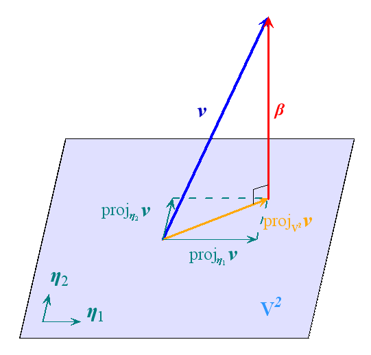

---
tags:
  - 数学
  - 线代
excerpt: 没有线性变换？还是太抽象了
---
有些东西太简单了就不放进来浪费时间了

### 化为正交

如果要把一组**基**化为正交基，那最常用的方法叫做**格拉姆-施密特正交化方法(Gram-Schmidt process)** ，就是计算量可能有一点大

下面的$(\alpha_2,\beta_1)$意为$\alpha_2$和$\beta_1$的点积

$(\alpha_1,\alpha_2,\alpha_3)$是原本的一组不正交的向量

$$
\left\{ \begin{aligned} 
&\beta_1 = \alpha_1 \\
&\beta_2 = \alpha_2 - \frac{(\alpha_2,\beta_1)}{(\beta_1,\beta_1)}\beta_1 \\
&\beta_3 = \alpha_3 - \frac{(\alpha_3,\beta_1)}{(\beta_1,\beta_1)}\beta_1 - \frac{(\alpha_3,\beta_2)}{(\beta_2,\beta_2)}\beta_2
\end{aligned} \right.
$$

得到的$(\beta_1,\beta_2,\beta_3)$就是一组正交向量，两者作为**基**是等价的

更多的向量以此类推就好

另外，$(\beta_1,\beta_1)$算的是$\beta_1$的**平方**！！！不是它的长度！！！

这有一张相关的图，来自[维基百科](https://zh.wikipedia.org/wiki/%E6%A0%BC%E6%8B%89%E5%A7%86-%E6%96%BD%E5%AF%86%E7%89%B9%E6%AD%A3%E4%BA%A4%E5%8C%96)。其中的$v$在$V^2$上投影，构造出$V^3$上的正交基$\beta$

还有一个概念叫做**正交矩阵**，一个满足$A^TA=AA^T=E$的矩阵$A$就是正交矩阵，这个矩阵对应的线性变换**只旋转而不缩放**，于是向量的前后长度是**不会变的**

可以发现$A^T=A^{-1}$

$A^{-1}$和$A^t$也都是正交矩阵，而且$\vert A\vert=±1$，如果$B$也是同阶的正交矩阵，那$AB$也是正交矩阵
### 何为特征

**特征向量**就是经过一个线性变换后**指向方向没有改变**的向量，**特征值**就是经过这个线性变换后向量**长度缩放**的值，即

$$Av=\lambda v$$
其中$v$为特征向量，$\lambda$为特征值，一组特征向量和特征值也可以表示一个线性变换

一个$n$阶的方阵会有$n$个对应的特征值，尽管可能重复

#### $\lambda$怎么算

由定义可知$(A-\lambda)v=0$，即$\left \vert A-\lambda E \right\vert = 0$

所以只要解$\vert A-\lambda E\vert=0$这个方程就好（解$\vert\lambda E-A\vert=0$也是一样的

得出的几个$\lambda$就是特征值，每个特征值对应的解的数量叫做它的**代数重数**，对应的**线性无关**的向量的数量叫做**几何重数**

**几何重数**亦可称为是这些向量张成的**特征子空间**的**维数**

一个矩阵的特征值正负数量分别被称为它的**正惯性指数**和**负惯性指数**

#### 特征向量怎么算

既然已经算出了$\lambda$的值，接下来就代入原式$(A-\lambda)v=0$算就好了（当然也有可能是$(\lambda-A)v=0$

#### 乱七八糟的性质

##### 特征值与迹
专家研究发现$\displaystyle \sum_{i=1}^n a_{ii} = \displaystyle \sum_{i=1}^n \lambda_i$，也就是主对角线上面**所有元素的和**等于**所有特征值的和**（**重复的特征值也要重复算！**）然后这个和还被起了个新名字叫**迹**，$A$的迹记作$tr(A)$，看起来是和秩属于同一批产物

以及$\vert A \vert =\displaystyle \prod_{i=1}^n \lambda_i$，用人话讲就是**特征值的积等于矩阵行列式的值**

##### 矩阵变形的特征值

如果说$\lambda$是$n$阶方阵$A$的特征值

那$A^m$的特征值就是$\lambda^m$，$kA$的特征值就是$k\lambda$，而特征向量不变

如果$A$还是可逆的，那$A^{-1}$的特征值是$\displaystyle\frac{1}{\lambda}$，而$\displaystyle\frac{A}{\lambda}$就是$A^*$的特征值，而特征向量还是不变

**转置**不改变特征值，但是特征向量**不确定**

### 相似为对角

==$n$阶方阵$A$可相似对角化的充要条件是$A$的**每个特征值**的**代数重数**等于它的**几何重数**==

那啥是相似对角化？

**相似对角化**顾名思义就是把矩阵化为一个相似的对角阵，此时由于对角阵的特性，算其幂次时会相当方便

不过可能是由于我们的水平太拉了，老师只教了怎么把**实对称矩阵**化为对角阵

#### 实际也不难

对一个实对称矩阵而言，**必定与一个对角阵相似**，所以都是有结果的

==对于实对称矩阵，**不同特征值**算出来的特征向量是**正交**的==

目标很简单，如果有个$3$阶实对称矩阵$A$，把它相似对角化就是求一个**正交矩阵**$Q$实现
$$
Q^TAQ=Q^{-1}AQ=\Lambda=
\left[ \begin{matrix} 
\lambda_1 &  &  \\ 
 & \lambda_2 &  \\
 &  & \lambda_3
\end{matrix}\right] 
$$
$Q$又由三个单位向量组成，即$Q=(\eta_1,\eta_2,\eta_3)$，$\lambda$ 和 $\eta$ **的位置必须要相对应**，不然不对

接下来就开始算吧

首先用上面的方法算出特征值和特征向量，然后看这几个特征向量是否正交，不正交就统统正交化

最后单位化（长度变为1）就得到$(\eta_1,\eta_2,\eta_3)$了