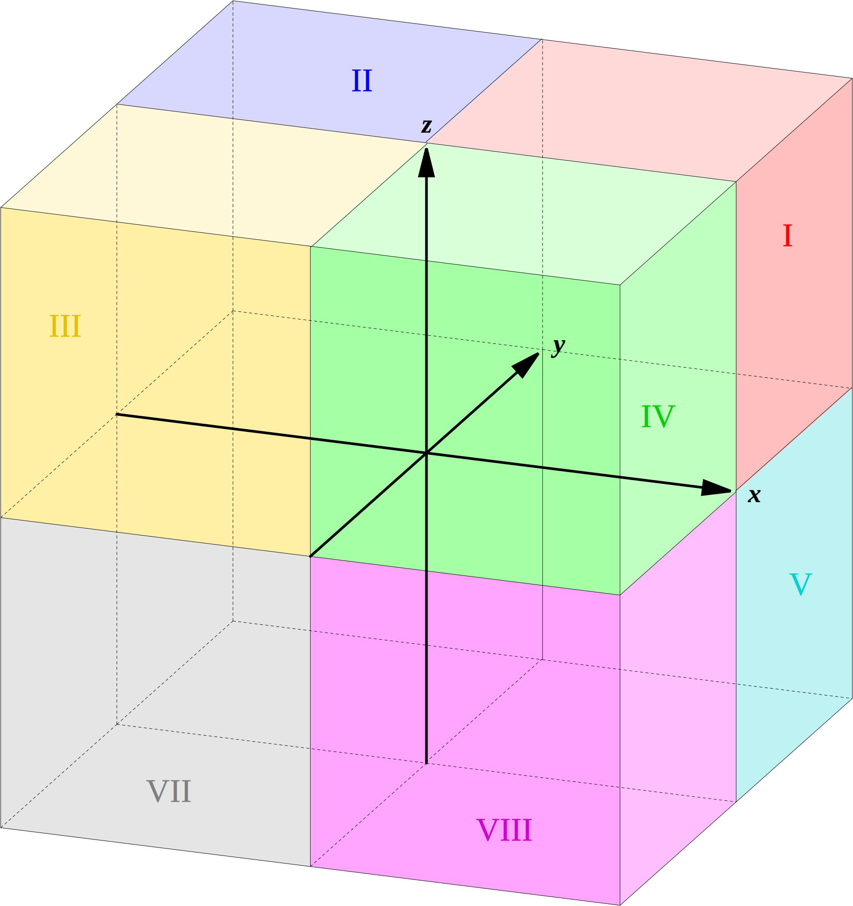

---
tags:
  - 高数
  - 数学
excerpt: 解几吗，赫赫，是高考把我拿下的东西呢
---
# 解析几何

~~你怎么支棱起来了~~

## 向量~

高中个个都会

那有新东西吗？有的兄弟有的

与二维的平面直角坐标系的**象限**对应的是空间直角坐标系中的**卦限**

>  两仪生四象，四象生八卦

其划分顺序也和象限是一样的，上面一圈是Ⅰ到Ⅳ，下面一圈是Ⅴ到Ⅷ

这是图，来自[维基百科](https://zh.wikipedia.org/wiki/%E5%8D%A6%E9%99%90)

**方向角**指一个向量和各个坐标轴上的**单位向量**成的角度，因为有 $x,y,z$ 轴，所以对应的方向角有 $\alpha, \beta, \gamma$ 三个，三个方向角对应的余弦值叫**方向余弦**

**投影**都知道是个啥，向量$\boldsymbol{a}$在$\boldsymbol{b}$上的投影写作$\text{Prj}_{\boldsymbol{b}}\boldsymbol{a}$或$(\boldsymbol{a})_{\boldsymbol{b}}$

### 向量的积

**数量积**个个都会，就是**点乘**，结果是个数值（**内积**），向量$\boldsymbol{a}$和$\boldsymbol{b}$的点乘就是$\boldsymbol{a} \cdot \boldsymbol{b}$

**向量积**，又称**叉乘**，结果是个向量（**外积**），向量$\boldsymbol{a}$和$\boldsymbol{b}$的叉乘就是$\boldsymbol{a} \times \boldsymbol{b}$

对于这个新的向量，其方向可以由传说中的右手定则确定：将右手张开，四指指向$\boldsymbol{a}$的方向，手掌垂直于$\boldsymbol{b}$的方向，大拇指所指的方向就是所得向量的方向，这个向量和$\boldsymbol{a}$与$\boldsymbol{b}$垂直

那这个向量的长度之类的要怎么算呢？其实前人总结了一套很简单的方法

$$
\boldsymbol{a} \times \boldsymbol{b} = \left | \begin {matrix} 
\boldsymbol{i} & \boldsymbol{j} & \boldsymbol{k} \\
a_x & a_y & a_z \\
b_x & b_y & b_z
\end {matrix} \right |
$$
这个行列式的结果算出来就是所得向量的三个分量，马上就能化成坐标算长度了

不难发现$\boldsymbol{a} \times \boldsymbol{b} = -\boldsymbol{b} \times \boldsymbol{a}$，通过简单的几何知识还可以发现$\boldsymbol{a} \times \boldsymbol{b}$的**模是这两个向量围成的平行四边形的面积**，即$|\boldsymbol{a} \times \boldsymbol{b}|=|\boldsymbol{a}||\boldsymbol{b}|\sin \theta$

还有个东西叫**混合积**，摆了考试不考X﹏X

## 平面和直线~

### 表示平面！

很显然，如果我们知道了平面上的一个点，又知道了它的一个法向量，那我们就能确定这个平面了（没有图，自己想像

众所周知，平面上的所有向量都和平面的法向量垂直，于是点乘结果都是$0$

 如果已知点的坐标为$(x_0, y_0, z_0)$，向量的坐标是$(A, B, C)$，那这个平面的方程就是

$$
A(x-x_0)+B(y-y_0)+C(z-z_0) = 0
$$

这是平面的**点法式**方程，如果括号全部展开就叫**一般方程**

如果要求两个平面的夹角的话，算算两个法向量的角度就好了

#### 有关点到平面距离公式

先来公式

$$
d = \frac{|Ax_0+By_0+Cz_0+D|}{\sqrt{A^2+B^2+C^2}}
$$

看着和那个点到直线距离公式有着异曲同工之妙呢

用简单的向量知识就能证明了

用这个公式还能得到两平行平面间的距离公式

$$
d = \frac{|D_2-D_1|}{\sqrt{A^2+B^2+C^2}}
$$
证明这个公式需要用到上面的公式以及平面本身的方程

### 表示直线！

很显然，两个平面相交就能确定一条直线，所以直线的一般方程就是

$$
\left\{ \begin{aligned} 
&A_1x+B_1y+C_1z+D_1 = 0 \\ 
&A_2x+B_2y+C_2z+D_2 = 0
\end{aligned} \right.
$$

真是朴实无华呢

但是如果用向量的角度来思考，那又会有不一样的结果

如果我们知道了直线上一点，又知道了上面的一个向量，显然这条直线就被确定了，如果已知点的坐标为$M_0(x_0, y_0, z_0)$向量的坐标为$\boldsymbol{s} = (m, n, p)$，对线上任意一点$M(x,y,z)$形成的的向量$\overrightarrow{M_0M} = (x-x_0, y-y_0, z-z_0)$都有

$$
\frac{x-x_0}{m} = \frac{y-y_0}{n} = \frac{z-z_0}{p}
$$

为啥捏，因为这两个向量是平行的，所以它们三个方向的分量是**成比例**的，于是就可以这么整，这个方程叫直线的**对称式方程**或者**点向式方程**

还有种表示方式是用参数方程，就是用$t$来表示$x,y,z$，看看课本就会了

那线线和线面夹角呢 

向量，还是靠向量

线线的夹角只需要靠两个**方向向量**的夹角就能轻松搞定，线面则是**法向量**与**方向向量**一起求出

## 曲面和曲线~

### 表示曲面！

曲面比平面复杂多了，有好多种

#### 旋转的

一条在平面上（ $xOy$ ， $xOz$ 或 $yOz$ ）的线绕某个坐标轴旋转得到的曲面就是**旋转曲面**

如果有个线的方程长这样

$$
f(y,z) = 0
$$

绕 $z$ 轴转一圈的话就能得到

$$
f(±\sqrt{x^2+y^2}, z) = 0
$$

绕 $y$ 轴一圈则是

$$
f(y, ±\sqrt{x^2+z^2}) = 0
$$

在脑中想象一下，就会发现这是个圆与勾股定理的问题

#### 柱形的

在三维空间中有个方程$x^2+y^2=R^2$，如果在平面上这就是个圆啊

但是在三维空间中没有了$z=0$的束缚，$z$可以取任何值，这样就变成了一个圆柱面了，在$xOy$平面上躺着的$x^2+y^2=R^2$这个圆叫它的**准线**，垂直于这个圆并且过这个圆上任意一点的无限长直线$l$则是它的**母线**（就像那个圆柱的母线一样

专家言：一般来说，直线$L$沿曲线$C$形成的轨迹叫**柱面**，$C$为**准线**而$L$是**母线**

#### 二次的

和圆锥曲线一样是相当有难度的东西呢，投降喵，以后有时间再来学

### 表示曲线！

和直线一样，曲线可以用两个相交的曲面表示

$$
\left\{ \begin{aligned} 
&F(x,y,z)=0 \\
&G(x,y,z)=0
\end{aligned} \right.
$$

也可以用参数方程表示

$$
\left\{ \begin{aligned} 
&x=x(t) \\ 
&y=y(t)\\
&z=z(t)
\end{aligned} \right.
$$

#### 曲线的投影（在坐标面上

如果要求某条曲线在$xOy$，$xOz$或$yOz$上的投影，只需在原本的方程中消掉某个变量（$x,y,z$之一），然后让这个变量等于$0$即可

比如要求这条线

$$
\left\{ \begin{aligned} 
&x^2+y^2+z^2 = 1 \\
&x^2+(y-1)^2+(z-1)^2 = 1
\end{aligned} \right.
$$

在$xOy$平面上的投影，只需要用$x,y$表示$z$，再让$z=0$即可

于是结果就是

$$
\left\{ \begin{aligned} 
&x^2+2y^2-2y = 0 \\
&z = 0
\end{aligned} \right.
$$

非常的简单

但是为啥高数要整这么多几何的东西呢？

当然是为了将来的[多元函数微分](2025-4-18-微分……导数……在三维空间还在追我.md)做铺垫啦

## 用多元微分来算几何~

### 算曲线的切线和法平面

这里有个曲线的参数方程

$$
\left\{ \begin{aligned} 
x = \phi ~(t), \\ y = \psi ~ (t), \\ z = \omega ~ (t),
\end{aligned} \right.

~~~~ t \in [\alpha, \beta]
$$

要求一个点$M(x_0,y_0,z_0)$上的**切线**和**法平面**，对应的$t$是$t_0$， 和一元函数一样，很容易发现这个点的导数就对应着这个点的切线，于是切向量$T = (\phi'(t_0), \psi'(t_0), \omega'(t_0))$，所以切线方程就是

$$
\frac{x-x_0}{\phi'(t_0)} = \frac{y-y_0}{\psi'(t_0)}=\frac{z-z_0}{\omega'(t_0)}
$$

而法平面就是在这个点和切线垂直的平面，显然切向量$T$就是这个平面的法向量，所以对应平面的方程是

$$
\phi~(t_0)(x-x_0)+\psi~(t_0)(y-y_0)+\omega~(t_0)(z-z_0)=0
$$

但是如果我们拿到的不是参数方程而是一个方程组呢？那就得用雅可比式或者梯度来算了

### 算曲面的法线和切平面

其实对于曲面$F=(x,y,z)$上的一个点$M(x_0,y_0,z_0)$来讲，切向量是一样的$\boldsymbol{T} = (\phi'(t_0), \psi'(t_0), \omega'(t_0))$

唉我懒得写怎么证了

总之在这一点上的法向量$\boldsymbol{n} = (F_x(x_0,y_0,z_0),F_y(x_0,y_0,z_0),F_z(x_0,y_0,z_0))$，有了法向量当然什么都能求出来了

切平面是

$$
F_x(x_0,y_0,z_0)(x-x_0)+F_y(x_0,y_0,z_0)(y-y_0)+F_z(x_0,y_0,z_0)(z-z_0) = 0
$$

法线是

$$
\frac{x-x_0}{F_x(x_0,y_0,z_0)}=\frac{y-y_0}{F_y(x_0,y_0,z_0)}=\frac{z-z_0}{F_z(x_0,y_0,z_0)}
$$

就这些